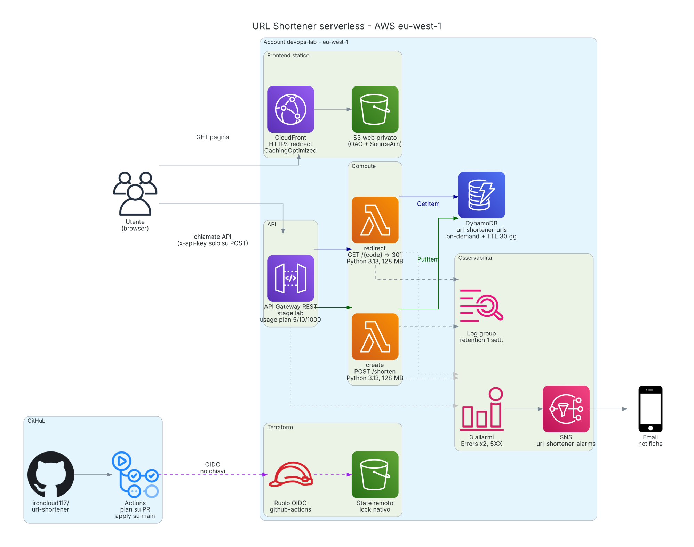

# URL Shortener — serverless on AWS, fully as code

A Bitly-like URL shortener built on AWS serverless services, provisioned entirely with Terraform and delivered through a GitHub Actions pipeline.



## Why this project

The starting point was the KodeKloud lab *Design a Bitly-like URL Shortener*, where every resource is created by hand in the AWS console. The goal here was different: rebuild the same workload from scratch as code, with the practices expected in a real environment — remote state, least-privilege IAM, no static credentials, peer review through pull requests, monitoring and a clean teardown.

## Architecture

All resources live in a dedicated sandbox account, region `eu-west-1`.

| Layer | Service | Notes |
|---|---|---|
| Frontend | S3 + CloudFront | Private bucket, Origin Access Control with `AWS:SourceArn` condition, HTTP redirected to HTTPS |
| API | API Gateway (REST) | `POST /shorten` requires an API key; `GET /{code}` is public; `OPTIONS` is a mock integration for CORS |
| Throttling | Usage plan | 5 requests/s, burst 10, 1,000 requests/month |
| Compute | Lambda (Python 3.13, 128 MB) | `create`: conditional `PutItem`, 7-character base62 code. `redirect`: `GetItem`, returns 301 or 404 |
| Data | DynamoDB | On-demand capacity, TTL of 30 days on `expires_at` |
| Observability | CloudWatch + SNS | Log groups with 1-week retention; alarms on Lambda `Errors` and API `5XXError`, notified by email |
| Delivery | GitHub Actions + OIDC | `plan` on pull requests, `apply` only on `main`; no long-lived AWS keys |
| State | S3 | Remote state with native S3 locking |

## Design choices

- **Least privilege everywhere.** Each Lambda has its own role: `create` can only `PutItem`, `redirect` can only `GetItem`, and both can only write to their own log group. A resource-based policy lets only this API, and only the matching method, invoke each function.
- **Log groups owned by Terraform.** The functions cannot create log groups, so no log group is left without retention.
- **Cost guardrails by design.** Throttled requests are rejected by API Gateway before reaching Lambda; DynamoDB is on-demand and old items expire through TTL. At rest the workload costs practically nothing.
- **Secrets out of the repository.** The alarm email is a GitHub secret, exposed to Terraform as `TF_VAR_alarm_email`; the API key is read from Terraform state and shared out of band.
- **Everything through pull requests.** Infrastructure changes are reviewed as a plan on the PR and applied by the pipeline after merge.

## Differences from the original lab

| Original lab | This implementation |
|---|---|
| Resources created by hand in the console | Every resource defined in Terraform, reproducible and destroyable |
| Local state, if any | Remote state in S3 with locking |
| Deploy from a workstation | GitHub Actions pipeline, OIDC federation, no static keys |
| Broad permissions | One role per function, least privilege, scoped invoke permissions |
| No monitoring | Alarms on errors and 5XX with email notification |
| Positive tests only | Negative tests first (403 without key, 403 on the bucket) |

## Repository layout

```
url-shortener/
├── .github/workflows/terraform.yml   plan on PR, apply on main via OIDC
├── bootstrap/   state bucket, OIDC provider and pipeline role
├── infra/       dynamodb, iam, lambda, apigateway, web, monitoring
├── src/
│   ├── create/app.py
│   └── redirect/app.py
├── web/index.html.tftpl
└── docs/        architecture diagram (PNG, SVG)
```

## Verification

- Browser: 403 without API key, 201 with key, 301 on the short link, 404 on an unknown code.
- Direct access to the S3 bucket returns 403; the page is reachable only through CloudFront.
- CORS preflight returns 200.
- Pipeline green on pull request and on `main`; `terraform plan` reports no changes after apply.
- SNS subscription confirmed; the three alarms move to `OK` and the email notifications arrive.
- External review by a member of the AWS User Group community, including very long URLs.

## Teardown

The application stack is destroyed first, then the bootstrap stack (state bucket, OIDC provider, pipeline role).

```bash
terraform -chdir=infra destroy
terraform -chdir=bootstrap destroy
```

## Making it public — suggested next step

This version is meant for controlled testing: the API key is shared with each tester. To turn it into an open web application:

- **Hide the key from the browser.** Serve the API under the same CloudFront distribution (`/api/*`) and let CloudFront add `x-api-key` as a custom origin header. The page calls its own domain, so CORS is no longer needed.
- **Protect per user, not per key.** Put AWS WAF in front of CloudFront with a rate-based rule per IP and the managed bot-control rules.
- **Prevent abuse.** An open shortener is a common tool for hiding phishing links: validate incoming URLs against a list of malicious domains and provide a way to disable a reported link.
- **Production polish.** Custom domain with Route 53 and ACM, automatic compression and a security headers policy on CloudFront.
- **Cost control.** An AWS Budget with alerts, since WAF adds a fixed monthly cost well above the current one.

## Lessons learned

- Line endings matter: `.gitattributes` with `eol=lf` and a fixed file mode on the Lambda archive keep the plan stable between Windows and the Linux runner.
- An SNS email subscription stays `PendingConfirmation` until the link is clicked; until then alarms notify no one.
- `treat_missing_data = notBreaching` plus `ok_actions` keeps an idle API in `OK` and proves the notification path end to end.
- An API key is not authentication: it ties calls to a usage plan. Identifying callers needs an authorizer (Cognito or IAM).
- Lambda cold starts are billed including the init phase; at 128 MB the only rightsizing lever is to increase memory, not reduce it.
